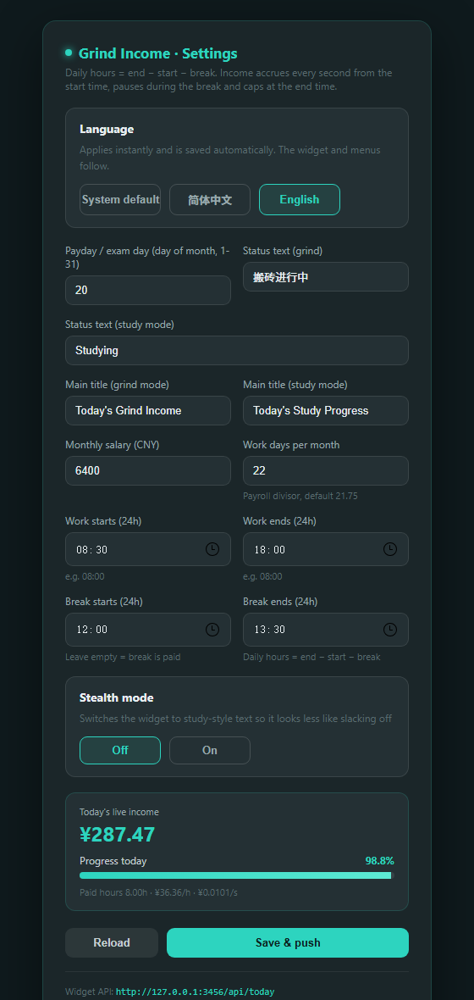

# Grind Widget (bzwidget)

**English** | [简体中文](README.md)

> A Windows desktop floating widget in the style of Momoyu Pro's sidebar card: it shows **today's income**, a **payday countdown**, your **daily progress** and a **status line** in real time. One click switches to a low-key "study mode", and the whole UI is **bilingual (English / Chinese)**. Settings changes take effect instantly — no restart.

*「搬砖」(bān zhuān, "carrying bricks") is Chinese slang for grinding away at a day job. This widget pays you for it, second by second.*




## ✨ Features

- **Bilingual UI** — follows your system language by default (English outside Chinese locales), or lock it to English / 简体中文. The widget, right-click menu, tray menu, preferences window and settings page all follow, and switching is instant.
- **Four themes** — Deep Mint, Cream Latte, Midnight Blue, Iris Dusk. One click in the preferences window, saved automatically.
- **Per-second pay** — income accrues every second from your start time, pauses during the unpaid break, and caps at the end time.
- **Payday countdown** — based on "day of month", handles month rollover and short months (day 31 falls back to the last day).
- **Free resizing** — drag any window edge; the size is remembered (minimum 200×170), with no visible resize grip.
- **Stealth mode** — flips the whole copy set to study wording (Study Progress · Studying · Exam in) so it looks less like slacking off.
- **Editable copy** — the card title and status text for both modes are configurable, and **your own text is never overwritten by a language switch**.
- **Built-in settings page** — opens inside the app window (no browser), and the widget refreshes as soon as you save.
- **Bring your own data source** — use the built-in API or point it at your own endpoint (requests are made from the main process, so no CORS issues).
- **Portable** — a single `bzwidget.exe`, no installation; cat icon and system tray included.

## 🌐 Language

| Option | Behaviour |
| --- | --- |
| System default | Chinese system locale → Chinese UI, anything else → English UI |
| 简体中文 | Always Chinese |
| English | Always English |

Two places to switch, both apply instantly and save automatically:

1. Right-click the widget → **Preferences** → **Language**
2. Right-click the widget → **Settings** → **Language** at the top of the page

## 🎨 Themes

| Theme | Colours | Notes |
| --- | --- | --- |
| Deep Mint | dark + teal accent | default, easy on the eyes at night |
| Cream Latte | light + coffee brown | better on bright desktops |
| Midnight Blue | dark + ice blue | cool, low distraction |
| Iris Dusk | dark + soft purple | gentle purple palette |

Right-click the widget → **Preferences** → **Theme**, click once and it applies immediately (no need to press Save). The card, the right-click menu and the preferences window follow the theme; the settings page keeps its own dark style.

## 📦 Download

- **GitHub Releases**: <https://github.com/huang2202926/bzwidget/releases> → download `bzwidget.zip`
- **Windows 64-bit only.** The binary is unsigned, so if SmartScreen blocks it, click *More info → Run anyway*.

## 🚀 Quick start

1. Double-click `bzwidget.exe` — the widget appears on your desktop, always on top by default.
2. Right-click the widget (or the tray icon) → **Settings**.
3. Fill in monthly salary, work days per month, start / end / break times and the payday, then click **Save & push**.
   - Times use 24-hour format (`08:00`, `18:00`, minutes allowed like `09:30`). Leave the break empty to have it paid.
4. Today's income accrues **every second** from the start time, pauses during the break and caps at the end time.
5. Want it low-key? Turn **Stealth mode** on and the copy switches to study wording.

## 💰 How the numbers are calculated

Income and progress are computed **live** (nothing is hard-coded):

```
paid hours per day = end − start − break            (break empty → 0)
income per second  = monthly salary ÷ work days ÷ (paid hours × 3600)
seconds worked     = clamp(now − start, 0, shift length) − break seconds already passed
income today       = income per second × seconds worked
progress (%)       = seconds worked ÷ (paid hours × 3600) × 100
```

> The break only counts when it sits fully inside the shift (otherwise it is ignored, so hours can never go negative).
> Example: 08:30–18:00 with a 12:00–13:00 break, ¥6400/month over 24 working days → 8.5 paid hours, ¥31.37/h, capped at ¥266.67 at 18:00.

## 🎓 Stealth mode

| Where | Off (grind) | On (study) | Chinese UI |
| --- | --- | --- | --- |
| Card title | Today's Grind Income | Today's Study Progress | 今日搬砖收入 / 今日学习进度 |
| Main number | ¥156.86 | 156.86 pts | ¥156.86 / 156.86 分 |
| Countdown | Payday in 8d 4h | Exam in 8d 4h | 距发薪还有 8 天 4 小时 / 距月考还有 8 天 4 小时 |
| Status | Grinding | Studying | 搬砖中 / 学习中 |
| Settings title | Grind Income · Settings | Study Progress · Settings | 搬砖收入 · 后台设置 |

Automatic states follow the language too: `Off the clock`, `On break`, `Done for today`.
Titles (`titleMoyu` / `titleStudy`) and statuses (`status` / `studyStatus`) are separately editable, and your custom text is preserved across language switches.

## 🔌 Built-in API

The settings page is rendered by a local HTTP server (`127.0.0.1:3456`, automatically moves to the next port if taken):

| URL | Purpose |
| --- | --- |
| `http://127.0.0.1:3456/` | settings page (shown in an app window, also openable in a browser) |
| `http://127.0.0.1:3456/api/today` | data the widget reads (computed live, includes the current `language`) |

`/api/today` response example (copy follows the current language):

```json
{
  "income": 156.86, "progress": 58.82, "stealthMode": true,
  "status": "Grinding", "studyStatus": "Studying",
  "titleMoyu": "Today's Grind Income", "titleStudy": "Today's Study Progress",
  "paydayDay": 20, "monthlySalary": 6400, "workDaysPerMonth": 24,
  "workStartTime": "08:30", "workEndTime": "18:00",
  "breakStartTime": "12:00", "breakEndTime": "13:00",
  "language": "en"
}
```

`POST /api/update` writes parameters (that is what the settings page does) and pushes a refresh immediately. It also accepts a top-level `language` field:

```json
{ "language": "en" }
```

`language` accepts `auto` (follow the system), `zh` or `en`.

## 🧩 Using your own data source

1. Right-click the widget → **Preferences**
2. Set **Data source** to **API** and enter your URL
3. For private endpoints, put `Cookie` / `Authorization` in the request headers as JSON:
   ```json
   { "Cookie": "session=xxx; token=yyy" }
   ```
4. Requests are sent from the main process, so CORS does not apply

Aliases accepted: `todayIncome`/`amount`, `percent`/`percentage`, `state`/`text`, `salaryDate`/`payday`.

## ⌨️ Interaction

| Action | Effect |
| --- | --- |
| Drag with left button | move the widget, position remembered |
| Drag a window edge | free resize, size remembered (minimum 200×170) |
| Right-click widget | refresh / settings / preferences / unpin / quit |
| Left-click tray | show / hide |
| Right-click tray | settings / preferences / refresh / pin toggle / quit |

## 🛠 Build from source

```bash
npm install            # install Electron
node run.js            # development mode
node build.js          # package portable exe → dist/bzwidget.exe
npm test               # config migration / themes / i18n / income / backup naming
```

`build.js` uses the npmmirror mirror and archives the previous exe into `dist/backups/`, named with that build's own version.

## 📁 Layout

```
momoyu-widget/
├── main.js          # Electron main process + built-in settings server
├── preload.js       # context bridge
├── index.html       # widget UI
├── renderer.js      # data fetching and rendering
├── styles.css       # styles
├── themes.css       # theme colour variables
├── themes.js        # theme registry (shared by main / renderer)
├── i18n.js          # zh/en string table (main / renderer / settings page)
├── income.js        # income + progress algorithm (UMD, language-aware status)
├── settings.html    # preferences window (theme + language)
├── settings.js
├── icon.ico/png     # app icon (cat)
├── tray.png         # tray icon
├── build.js         # packaging script (archives old releases)
├── test-migrate.js  # config migration and algorithm tests
├── test-income.cjs  # income algorithm and renderer tests
├── test-i18n.cjs    # zh/en string table consistency tests
├── test-backup.cjs  # old-release archiving tests
├── README.md        # Chinese README
├── README.en.md     # this file
└── package.json
```

## ⚙️ Config and logs

- Config: `~/.momoyu-widget/config.json`
- Startup log: `~/.momoyu-widget/startup.log`

## 📄 License

[MIT](LICENSE) © huang2202926
