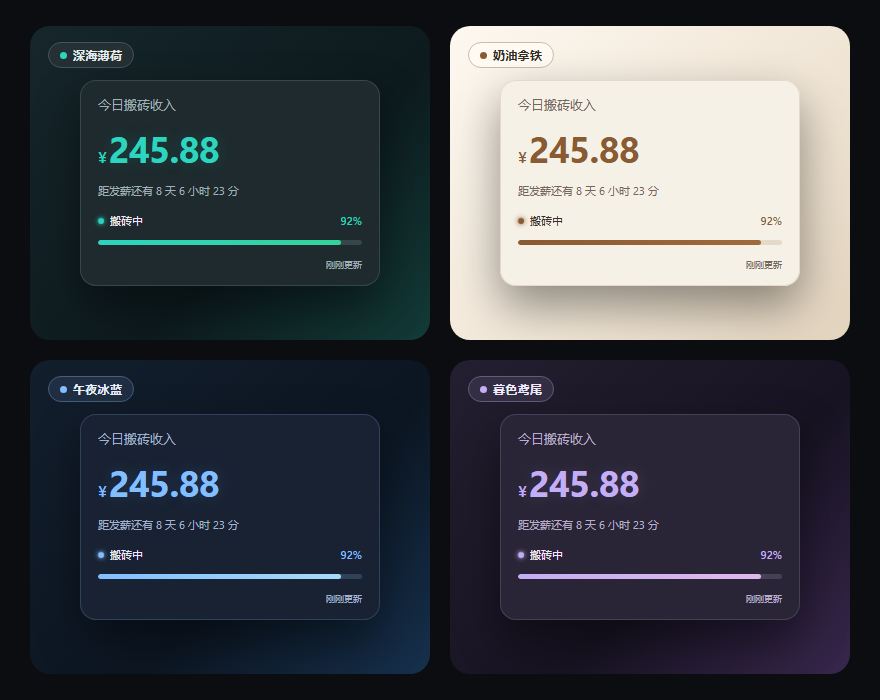
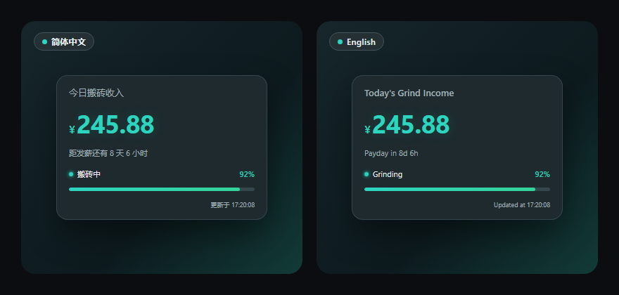
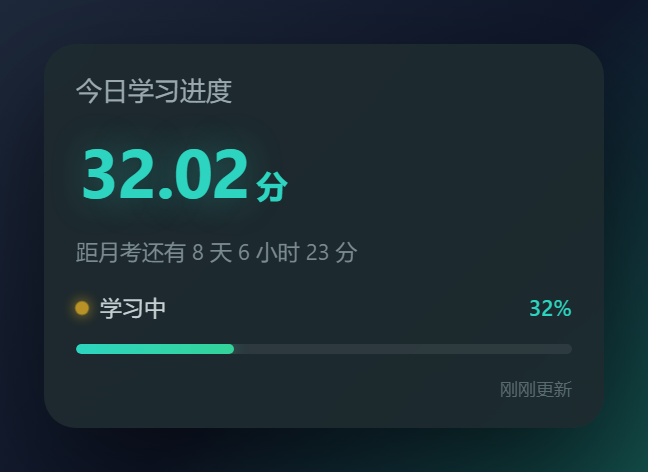
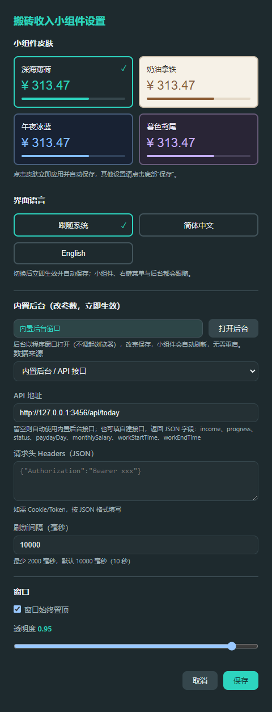
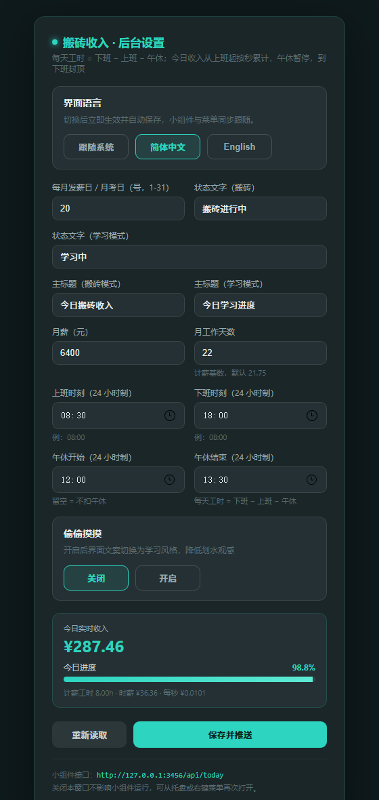

# 搬砖收入桌面小组件（bzwidget）

[English](README.en.md) | **简体中文**

> 仿 Momoyu Pro 侧边栏卡片风格的 Windows 桌面悬浮小组件：实时显示**今日搬砖收入**、**发薪倒计时**、**搬砖进度**与**状态文字**；一键切换「学习模式」低调显示；**界面支持中英双语**；后台设置改完即时生效，无需重启。










## ✨ 功能特性

- **中英双语界面**：默认跟随系统语言（中文系统显示中文、其他系统显示英文），也可手动锁定中文 / English；小组件、右键菜单、托盘菜单、偏好窗口、后台设置页全部跟随，切换即时生效。
- **四套皮肤**：深海薄荷 / 奶油拿铁 / 午夜冰蓝 / 暮色鸢尾，偏好窗口点一下立即换色并自动保存。
- **实时按秒计费**：从上班时刻起每秒累计收入，午休期间自动暂停，到下班时刻封顶。
- **发薪倒计时**：按「每月几号」计算下一次发薪日（学习模式下即「月考日」），自动跨月、小月取月末。
- **自由缩放**：拖动窗口边缘即可缩放，尺寸自动记住（最小 200×170），无右下角视觉手柄。
- **学习模式（偷偷摸摸）**：一键把「搬砖」文案整组切换成学习风格（今日学习进度 · 学习中 · 距月考还有），降低划水观感，开关即时生效。
- **可编辑文案**：卡片标题、状态文字（搬砖 / 学习）均可在后台自定义，**自定义文案不受界面语言影响**。
- **内置后台设置**：以程序自身窗口打开（不调起浏览器），改参数保存后小组件立刻刷新。
- **多数据源**：支持内置后台，也可接入你自己的接口（主进程代理请求，绕过 CORS）。
- **便携免安装**：单文件 `bzwidget.exe`，双击即跑；自带的猫图标 + 系统托盘。

## 🌐 界面语言

| 选项 | 行为 |
| --- | --- |
| 跟随系统（默认） | 系统语言是中文 → 中文界面；其他 → 英文界面 |
| 简体中文 | 锁定中文 |
| English | 锁定英文 |

切换入口有两个，改完立即生效并自动保存：

1. 右键小组件 → **小组件偏好** → **界面语言**
2. 右键小组件 → **后台设置** → 页面顶部 **界面语言**

小组件文案、右键菜单、托盘菜单、偏好窗口、后台页都会跟随；卡片标题与状态文字如果你自己改过，则一直保留你的文字（内置默认值会随语言切换）。

## 🎨 皮肤（四套）

| 皮肤 | 配色 | 说明 |
| --- | --- | --- |
| 深海薄荷 | 深色底 + 青绿高亮 | 默认皮肤，夜里不刺眼 |
| 奶油拿铁 | 浅色底 + 咖啡棕 | 白天或浅色桌面上更清楚 |
| 午夜冰蓝 | 深色底 + 冰蓝 | 冷色调，低干扰 |
| 暮色鸢尾 | 深色底 + 淡紫 | 紫色系，柔和 |

切换方式：右键小组件 → **小组件偏好** → **小组件皮肤** → 点一下立即换色并自动保存（不必再点底部「保存」）。
小组件卡片、右键菜单、偏好窗口都跟随当前皮肤；收入参数后台页保持原有深色样式。

## 📦 下载

- **GitHub Releases**：<https://github.com/huang2202926/bzwidget/releases> → 下载 `bzwidget_v1.1.0.zip`（或直接下 `bzwidget.exe`）
- 仅支持 **Windows 64 位**（无签名，首次运行若被 SmartScreen 拦截，点「更多信息 → 仍要运行」即可）。

## 🚀 快速开始

1. 双击 `bzwidget.exe`（免安装单文件版），小组件出现在桌面，默认置顶。
2. 右键小组件（或右键托盘图标）→ **后台设置**。
3. 在后台窗口填写：月薪、月工作天数、上班 / 下班 / 午休时刻、每月发薪日等，点 **保存并推送**。
   - 时刻均为 **24 小时制**（`08:00`、`18:00`，支持分钟如 `09:30`）；午休留空 = 不扣午休。
4. 今日收入从上班时刻起**按秒累计**，午休暂停，下班封顶；进度条随计薪工时增长，每秒自动刷新。
5. 想要低调一点：后台「偷偷摸摸」点 **开启**，文案立即切成学习风格。

## 💰 收入怎么算

收入与进度随当前时间**实时计算**（不是写死的值），公式如下：

```
每天计薪工时 = 下班 − 上班 − 午休时长          （午休留空则为 0）
每秒收入      = 月薪 ÷ 月工作天数 ÷ (计薪工时 × 3600)
今日已工作秒数 = clamp(现在 − 上班, 0, 在岗时长) − 已过去的午休秒数
今日收入      = 每秒收入 × 今日已工作秒数
进度(%)       = 今日已工作秒数 ÷ (计薪工时 × 3600) × 100
```

> 午休必须完整落在上班~下班区间内才生效（否则忽略），避免出现负工时。
> 示例：08:30–18:00、午休 12:00–13:00、月薪 6400、月工作 24 天 → 计薪工时 8.5h、时薪 ¥31.37；18:00 封顶 ¥266.67。

## 🎓 学习模式（偷偷摸摸）

后台「偷偷摸摸」一键换文案，开启后不再出现「搬砖」字样：

| 位置 | 关闭（搬砖） | 开启（学习） | 英文界面 |
| --- | --- | --- | --- |
| 卡片标题 | 今日搬砖收入 | 今日学习进度 | Today's Grind Income / Today's Study Progress |
| 主数字 | ¥156.86 | 156.86 分 | ¥156.86 / 156.86 pts |
| 倒计时 | 距发薪还有 8 天 4 小时 | 距月考还有 8 天 4 小时 | Payday in 8d 4h / Exam in 8d 4h |
| 状态文字 | 搬砖中 | 学习中 | Grinding / Studying |
| 后台页标题 | 搬砖收入 · 后台设置 | 学习进度 · 后台设置 | Grind Income · Settings |

- 自动状态（上班前 / 午休中 / 今日完成）同样按语言显示：`Off the clock` / `On break` / `Done for today`。
- 卡片标题（`titleMoyu` / `titleStudy`）与状态文字（`status` / `studyStatus`）均可分别自定义；**只要是你自己填的文字就原样保留**，不会被语言切换覆盖。

## 🔌 内置后台接口

后台由一个本地 HTTP 服务渲染（`127.0.0.1:3456`，端口被占用会自动顺延）：

| 地址 | 用途 |
| --- | --- |
| `http://127.0.0.1:3456/` | 后台设置页（程序窗口内显示，也可浏览器打开） |
| `http://127.0.0.1:3456/api/today` | 小组件读取的数据接口（实时计算，附带当前 `language`） |

`/api/today` 返回示例（实时计算，非写死；文案随当前语言）：

```json
{
  "income": 156.86, "progress": 58.82, "stealthMode": true,
  "status": "搬砖中", "studyStatus": "学习中",
  "titleMoyu": "今日搬砖收入", "titleStudy": "今日学习进度",
  "paydayDay": 20, "monthlySalary": 6400, "workDaysPerMonth": 24,
  "workStartTime": "08:30", "workEndTime": "18:00",
  "breakStartTime": "12:00", "breakEndTime": "13:00",
  "language": "zh"
}
```

`POST /api/update` 可写入参数（后台页就是这么做的），保存时立即推送刷新，不必等轮询；也可带顶层 `language` 字段切换界面语言：

```json
{ "language": "en" }
```

`language` 取值：`auto`（跟随系统）/ `zh` / `en`。

## 🧩 接入自己的数据源

小组件不限定数据来源，任何返回上述结构的接口都能用：

1. 右键小组件 → **小组件偏好**
2. 「数据来源」选 **API 接口**，填入你的接口地址
3. 私有接口把 `Cookie` / `Authorization` 按 JSON 填进请求头：
   ```json
   { "Cookie": "session=xxx; token=yyy" }
   ```
4. 请求由主进程发出，不受浏览器 CORS 限制

字段兼容别名：`todayIncome`/`amount`、`percent`/`percentage`、`state`/`text`、`salaryDate`/`payday`。

## ⌨️ 交互

| 操作 | 效果 |
| --- | --- |
| 左键拖动 | 移动小组件，位置自动记住 |
| 拖动窗口边缘 | 自由缩放，尺寸自动记住（最小 200×170） |
| 右键小组件 | 刷新 / 后台设置 / 偏好 / 取消置顶 / 退出 |
| 左键托盘 | 显示 / 隐藏 |
| 右键托盘 | 后台设置 / 偏好 / 刷新 / 置顶开关 / 退出 |

## 🛠 从源码构建

```bash
npm install            # 安装依赖（Electron）
node run.js            # 开发模式
node build.js          # 打包便携版 exe → dist/bzwidget.exe
npm test               # 配置迁移 / 皮肤 / 语言 / 收入算法 / 归档命名测试
```

`build.js` 已内置 npmmirror 镜像，并在打包前把 `dist` 里的旧 exe 归档到 `dist/backups/`（用旧包自己的版本号命名）。

## 📁 目录结构

```
momoyu-widget/
├── main.js          # Electron 主进程 + 内置后台服务
├── preload.js       # 安全桥接
├── index.html       # 小组件主界面
├── renderer.js      # 数据获取与渲染
├── styles.css       # 样式
├── themes.css       # 四套皮肤的配色变量
├── themes.js        # 皮肤注册与应用（主进程 / 渲染进程共用）
├── i18n.js          # 中英文案表与取词（主进程 / 渲染进程 / 后台页共用）
├── income.js        # 收入与进度算法（UMD，前后端共用，状态文案随语言）
├── settings.html    # 小组件偏好设置窗口（皮肤 + 界面语言）
├── settings.js      # 偏好设置逻辑
├── icon.ico/png     # 应用图标（猫）
├── tray.png         # 托盘图标
├── build.js         # 打包脚本（旧版本自动归档到 dist/backups）
├── test-migrate.js  # 配置迁移与算法单元测试
├── test-income.cjs  # 收入算法与渲染测试
├── test-i18n.cjs    # 中英文案表一致性测试
├── test-backup.cjs  # 旧版本归档命名测试
├── README.md        # 中文说明（本文件）
├── README.en.md     # English README
└── package.json
```

## ⚙️ 配置与日志

- 配置：`~/.momoyu-widget/config.json`
- 启动日志：`~/.momoyu-widget/startup.log`

## 📄 许可证

[MIT](LICENSE) © huang2202926
